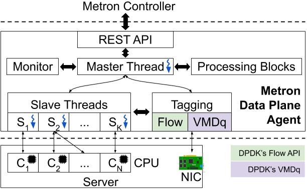

Metron
=========
[Metron][metron-paper] is an ultra high performance and efficient NFV service chaining platform, appeared in [USENIX NSDI 2018][metron-nsdi-page].


About
----
Metron's [control plane][metron-ctrl] is based on the [ONOS SDN controller][onos], which we extended with [southbound drivers][metron-driver] that allow Metron to monitor and configure important resources (i.e., CPU cores and network cards) on commodity servers.

Metron's data plane is based on a multi-threaded agent which conforms to the master-slave model, as shown in the figure below.

<p align="center"> 
    
</p>

The master (main thread) implements a REST-based protocol that allows the data plane to communicate its resources to the Metron controller. Apart from monitoring, the controller may also instruct the agent to perform service chain deployment operations. Such operations are realized as slave processes associated with NIC Rx/Tx queues and designated CPU cores.
The Metron data plane uses two features available in modern network interface cards (NICs) to achieve accurate dispatching of input traffic to the desired CPU core(s), thus eliminating inter-core communication.
Specifically, the Metron data plane uses either:
  1. the Virtual Machine Device queues (VMDq) to implement hardware dispatching based on the values of input packets' destination MAC address. VMDq requires a device prior to the server to tag incoming packets with the correct destination MAC address value, which will be matched by the NIC of the Metron data plane agent to perform CPU core dispatching.
This task is automatically performed by the Metron controller, using e.g., an OpenFlow switch between a traffic source and the NFV server where the Metron agent is deployed.
  2. DPDK's Flow API library (e.g., [Intel's Flow Director][intel-flowdir] or [Mellanox ASAP<sup>2</sup>][mlnx-asap2]) to classify and dispatch input traffic to available NIC queues (associated with CPU cores). Stateless packet classification or modification operations are encoded as NIC match-action flow rules. The match operations classify input traffic, while packets can be modified/dropped using action operations. Traffic dispatching is also part of the actions, as matched packets can be sent to a designated hardware queue (associated with a CPU core). Flow-based dispatching mode allows a Metron server to perform traffic classification and dispatching using its own NIC(s), without involving any prior network element in the path (as per VMDq).

The Metron data plane extends [FastClick][fastclick] (see the FastClick paper [here][fastclick-paper]), which in turn uses [DPDK][dpdk] as a high performance network I/O subsystem.
Recent DPDK developments allow Metron to use regural Linux kernel interfaces with DPDK's AF_PACKET PMD or XDP.

For compatibility reasons with regular FastClick deployments, the Metron data plane also supports Receive-Side Scaling (RSS) dispatching, which however restricts packet dispatching accuracy.

This repository provides the source code of Metron's high performance data plane.
The [Metron controller][metron-ctrl] is released as an ONOS application.


Metron Protocol
----
Metron agents are managed by the Metron controller via a REST-based protocol.
The management operations include resource advertisement, monitoring, service chain deployment, service chain reconfiguration (i.e., for load balancing), service chain removal, as well as NIC rule management operations (i.e., NIC rule installation, reporting, and deletion).
The protocol that prescribes this communication between the Metron controller and Metron agents is detailed in [this][metron-tutorial] tutorial.


Configure
----
First, setup your DPDK environment (version 17.05 or later) and then configure Metron with:
```bash
./configure RTE_SDK=path-to-dpdk RTE_TARGET=dpdk-target --enable-multithread --disable-linuxmodule --enable-intel-cpu --enable-user-multithread --verbose CFLAGS="-std=gnu11 -O3" CXXFLAGS="-std=gnu++14 -O3" --disable-dynamic-linking --enable-poll --enable-bound-port-transfer --enable-dpdk --enable-batch --with-netmap=no --enable-zerocopy --enable-dpdk-pool --disable-dpdk-packet --enable-nanotimestamp --enable-all-elements --enable-json --enable-cpu-load --enable-task-stats
```


Build
----
```bash
make
```


Deployment Examples
----
To deploy a Metron server in Flow-based dispatching mode, do:
```bash
sudo bin/click --dpdk -l 0-15 -v -- conf/metron/metron-dispatcher-flow.click
```

To deploy a Metron server in Flow-based dispatching mode using Linux kernel interfaces, we offer two possibilities.
First, using DPDK's AF_PACKET PMD, as follows:
```bash
sudo bin/click --dpdk -l 0-1 -w 0000:01:00.0 -w 0000:01:00.1 -v \
        --vdev=eth_af_packet0,iface=eno1,blocksz=4096,framesz=2048,framecnt=512,qpairs=1,qdisc_bypass=0 \
        --vdev=eth_af_packet1,iface=eno2,blocksz=4096,framesz=2048,framecnt=512,qpairs=1,qdisc_bypass=0 \
        -- conf/metron/metron-dispatcher-flow-legacy-af-pkt.click
```

Second, using DPDK's AF_XDP PMD, as follows:
```bash
sudo bin/click --dpdk -l 0-1 -w 0000:01:00.0 -w 0000:01:00.1 -v \
        --vdev net_af_xdp,iface=eno1 \
        --vdev net_af_xdp,iface=eno2 \
        -- conf/metron/metron-dispatcher-flow-legacy-af-xdp.click
```

To deploy a Metron server in MAC-based VMDq dispatching mode, do:
```bash
sudo bin/click --dpdk -l 0-15 -v -- conf/metron/metron-dispatcher-vmdq.click
```
Note that this mode requires special NIC support, thus may require NIC driver configuration.

To test Metron's compatibility with regular FastClick deployments, you can also deploy a Metron server in RSS mode as follows:
```bash
sudo bin/click --dpdk -l 0-15 -v -- conf/metron/metron-dispatcher-rss.click
```


Citing Metron
----
If you use Metron in your work, please cite our [paper][metron-paper]:
```
@inproceedings{katsikas-metron.nsdi18,
	author       = {Katsikas, Georgios P. and Barbette, Tom and Kosti\'{c}, Dejan and Steinert, Rebecca and Maguire Jr., Gerald Q.},
	title        = {{Metron: NFV Service Chains at the True Speed of the Underlying Hardware}},
	booktitle    = {15th USENIX Conference on Networked Systems Design and Implementation (NSDI 18)},
	series       = {NSDI'18},
	year         = {2018},
	isbn         = {978-1-931971-43-0},
	pages        = {171--186},
	numpages     = {16},
	url          = {https://www.usenix.org/system/files/conference/nsdi18/nsdi18-katsikas.pdf},
	address      = {Renton, WA},
	publisher    = {USENIX Association}
}
```


Getting help
----
Use the github [issue tracker][fastclick-issue-tracker] or contact Tom Barbette (barbette at kth.se) and/or
Georgios Katsikas (katsikas.gp at gmail.com) if you encounter any problems with Metron.

Please do not report Metron-related or FastClick-related problems on the vanilla Click mailing list.
If you are sure that your problem is Click related, post it on vanilla Click's [issue tracker][click-issue-tracker].

The FastClick README is available [here][fastclick-readme], while the original Click README is available [here][click-readme].

[metron-paper]: https://www.usenix.org/system/files/conference/nsdi18/nsdi18-katsikas.pdf
[metron-nsdi-page]: https://www.usenix.org/conference/nsdi18/presentation/katsikas
[onos]: https://onosproject.org/
[metron-ctrl]: https://github.com/gkatsikas/onos/tree/metron-ctrl-1.15.0
[metron-driver]: https://github.com/opennetworkinglab/onos/tree/master/drivers/server
[metron-tutorial]: https://wiki.onosproject.org/display/ONOS/Server+Device+Driver+Tutorial
[fastclick]: https://github.com/tbarbette/fastclick
[fastclick-paper]: https://orbi.uliege.be/bitstream/2268/181954/1/userspaceio.pdf
[dpdk]: https://dpdk.org/
[fastclick-issue-tracker]: https://github.com/tbarbette/fastclick/issues
[click-issue-tracker]: https://github.com/kohler/click/issues
[fastclick-readme]: README.fastclick.md
[click-readme]: README.original.md
[intel-flowdir]: https://www.intel.com/content/dam/www/public/us/en/documents/white-papers/intel-ethernet-flow-director.pdf
[mlnx-asap2]: https://www.mellanox.com/products/ASAP2
